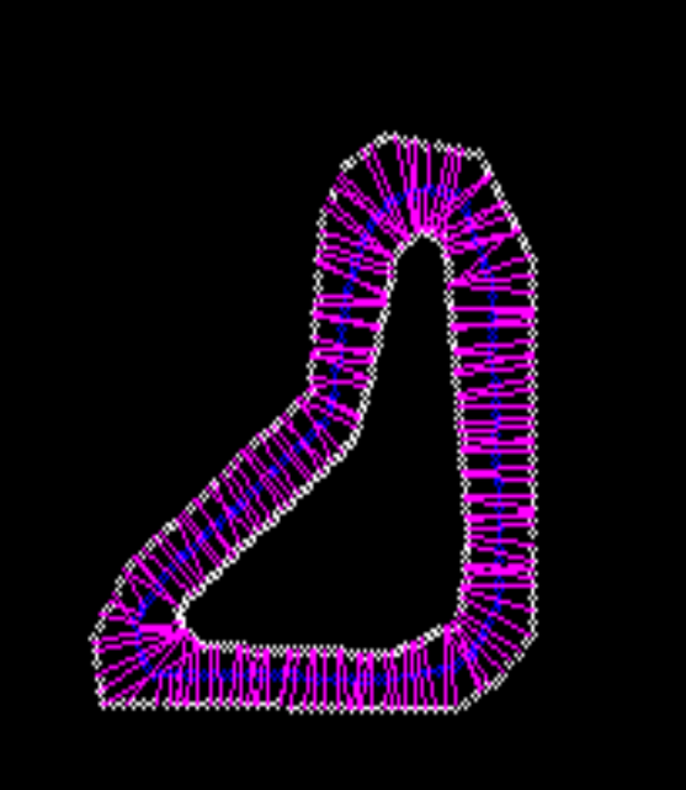

# KartingLines

This is a simple platform to play with algorithms to generate the optimal racing lines for karts.
Currently, I am not doing any actual physics simulations, just relying on some formulas I found 
in research papers. I intend to develop this further, potentially integrate with some vision and 
SLAM technology, and try out in TORCS. Right now I have two main approaches.

### Genetic Algorithm
I first generate normal lines around the track, then subdivide those normal lines. A racing
line is then just connecting the points of those subdivided normals. I penalize length and
curvature as a measure of fitness. This approach needs to be trained a bit more, though the 
initial results are promising. 

### Algorithmic Approach
I again subdivide into normal lines, then I take a greedy approach to minimizing distance
and curvature. 

This is an example of the tangent lines generated for a simple track.